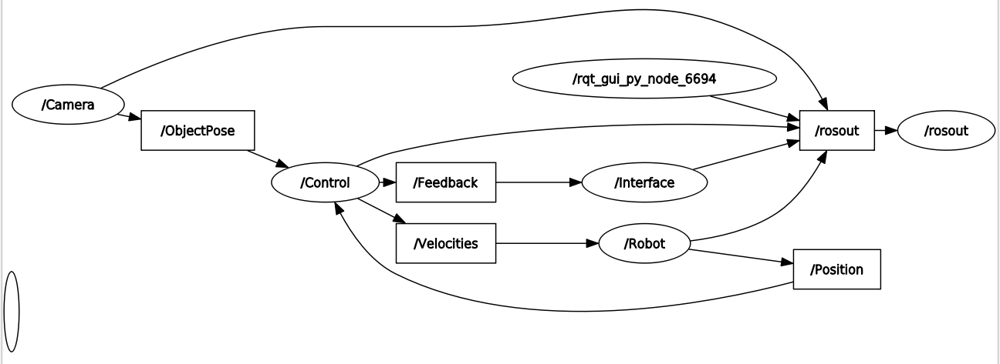
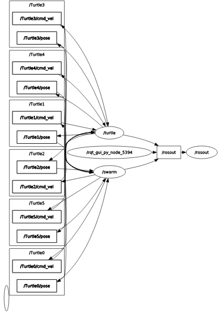
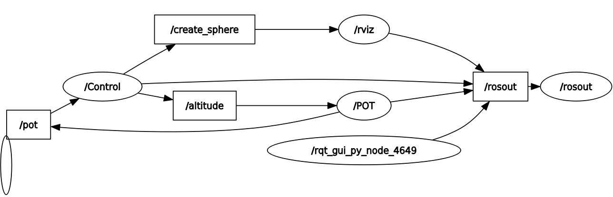

# ROS1 Assignments – Operating Systems Course

This repository contains all the ROS1 assignments completed as part of the **Operating Systems** course in my fourth year. The assignments cover various aspects of ROS1, including robot control, visualization in RViz, swarm robotics, and integration with sensors and hardware.

---

## Repository Structure

- [Assignment 1 – Two-wheeled ground robot control with target tracking.](#assignment-1-two-wheeled-ground-robot-control)
- [Assignment 2 – Swarm of turtles moving in synchronized circular paths.](#assignment-2-turtle-swarm-circular-motion)
- [Assignment 3 – RViz environment visualization and path planning.](#assignment-3-rviz-path-planning)
- [Assignment 4 – Sphere altitude control with Arduino potentiometer input.](#assignment-4-sphere-altitude-control-via-arduino)
- [Exam Project – URDF modeling of RRP planar manipulator and end-effector visualization.](#exam-project-rrp-planar-robot-manipulator)

---
## Assignment 1: Two-Wheeled Ground Robot Control

**Objective:**  
Design a ROS communication system to control a two-wheeled ground robot to track a moving target.

**Description:**  
- Robot publishes its coordinates; camera node publishes target coordinates.
- Control node calculates angular error and generates linear/angular velocities:

$$
e = \tan^{-1} \left( \frac{ \sin\left( \tan^{-1}\left( \frac{y_r - y}{x_r - x} \right) - \theta \right) }{ \cos\left( \tan^{-1}\left( \frac{y_r - y}{x_r - x} \right) - \theta \right) } \right)
$$


- Speeds: `w = e * Kp`, `V = constant`, decreasing as the robot approaches the target. Robot stops within 20 cm of target.
- Custom ROS messages:
  - `ObjectPosition.msg`: `Int8 Xr`, `Int8 Yr`
  - `RobotPosition.msg`: `Int8 X`, `Int8 Y`, `Float8 theta`
  - `Velocities.msg`: `Float32 Forward_Velocity`, `Float32 Angular_Velocity`

**Notes:**
- Camera node supports adjustable message frequency and queue size.
- Control node uses messages to compute velocities.
- Interface node prints feedback to `/feedback`.

**Running the Package:**
Each of the following commands must be run in a separate terminal:
```bash
roscore
rosrun hw1 Camera.py
rosrun hw1 Control.py
rosrun hw1 Robot.py
rosrun hw1 Interface.py
```

**RQT Graph:**

<p align="center">
  
</p>

---

## Assignment 2: Turtle Swarm Circular Motion

**Objective:**  
Spawn a swarm of `n` turtles in `turtlesim` and move them along synchronized circular paths.

**Description:**  
- Implement a PID controller for each turtle.
- Each turtle moves individually to its desired `(x, y)` position.
- Use `.yaml` file for ROS parameters.
- Spawn all turtles at the center of the map; they fan out along their paths.
- Create `swarm.launch` to launch and visualize the turtles.

**Running the Package:**
```bash
roslaunch hw2 swarm.launch
```

**RQT Graph:**

<p align="center">
  
</p>

**Result:**

<p align="center">
  
</p>


---

## Assignment 3: RViz Path Planning

**Objective:**  
Visualize a robot’s environment in RViz and generate a path from start to goal.

**Description:**  
- `params.yaml` contains obstacle and start/goal data.
- `obstacles.py` loads obstacles and visualizes them as green cubes.
- `get_path.py` computes a path using a path planning algorithm (e.g., Dijkstra, A*, RRT).
- RViz displays:
  - Generated path
  - Red spherical robot following the path
- Launch via `follow_path.launch`.

**Running the Package:**
```bash
roslaunch hw3 follow_path.launch
```

**RQT Graph:**

<p align="center">
  
</p>

**Result:**

<p align="center">
  
</p>

---

## Assignment 4: Sphere Altitude Control via Arduino

**Objective:**  
Control the Z-coordinate of a sphere in RViz based on a potentiometer connected to Arduino.

**Description:**  
- Arduino publishes `/potentiometer` values (0–1023).
- `/control` node maps values to Z-coordinate using `z-min` and `z-max` from ROS parameters.
- Sphere altitude is published to `/altitude`.
- LED flashes based on Z value and tolerance.
- Tolerance and Z mapping are configurable via ROS parameters.

**Running the Package:**
```bash
roslaunch hw4 launch.launch
```

**RQT Graph:**

<p align="center">
  
</p>

**Result:**

<p align="center">
  
</p>

---

## Exam Project: RRP Planar Robot Manipulator

**Objective:**  
Create a URDF model for an RRP planar manipulator and visualize the end-effector trajectory.

**Description:**  
- URDF modeled with Xacro using `variables.xacro`.
- Node `end_effector_pose.py` computes and publishes end-effector position.
- `marker.py` visualizes the end-effector in RViz using a marker.
- `path.py` visualizes task space trajectory.
- Color control via service `end_color.srv` and server node.
- Launch entire project with `world.launch`.

**Robot Specs:**

| Link | Length (cm) | Radius (cm) |
|------|------------|------------|
| 1    | 100        | 10         |
| 2    | 100        | 10         |
| 3    | 130        | 5          |


| Joint | Type      | Min (rad/cm) | Max (rad/cm) |
|-------|-----------|-------------|-------------|
| j1    | Revolute  | -π/2        | π/2         |
| j2    | Revolute  | -π/2        | π/2         |
| j3    | Prismatic | 35          | 40          |

**Running the Package:**
```bash
roslaunch p1 world.launch
```

**RQT Graph:**

<p align="center">
  
</p>

**Result:**

<p align="center">
  
</p>
